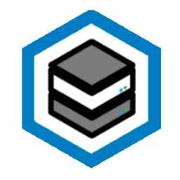

# Hi there stranger! :wave:
## :rocket: About Me

:mortar_board: I am **Joenne Spreuwers**, a 16yo Belgian student that likes to code in his free time. I'm currently studying **Math/Sciences** and looking forward to go study **Networking** and getting my [Network+](https://www.comptia.org/certifications/network)/[CCNA](https://www.cisco.com/c/en/us/training-events/training-certifications/certifications/associate/ccna.html) afterward.

:floppy_disk: I love to code whenever I can. I'm currently learning **JavaScript** and have basic knowledge of **Python** and **Bash**. I also own my own [homelab](#home-lab) where i self host **dockers** containing **game servers**, [**websites**](#links), and more.

:art: Whenever a friend or relative needs a **logo**, **banner**, or **other digital art**, they can [contact](#links) me with the question if I could make something for them (so can you). I always replied happily and made some [beatifull things](#gallery) :smile:

:camera_flash: I'm doing **photography** now for about **5 years**, I post (almost) every picture I snap on my [Instagram](https://www.instagram.com/joennespreuwers_/). Leave a like if you want :heart:

:radio: I'm always listening to music, some of my favorite genres are 70's, LoFi, Jazz, and DnB. Wanna check out some of my playlists? Head to [links](#links) and find my Spotify.

:joystick: I like to game (when I'm not coding ofc), some titles that I play are **Minecraft**, **CS:GO**, **Rocket League**, and **Apex Legends**. If u ever wanna play with me, [hit me up](#links).

<h2 id="home-lab">
  
  Home Lab - Soon Upgrading
</h2>

I own an old **Hp Proliant DL380g6** that I use to host all my projects on. I got it as a birthday gift from my Uncle and gotta say, that that is probably one of the best gifts I ever got :smile:

### Specs:
- :abacus: CPU: 2x Intel **Xeon** x5670
- :floppy_disk: RAM: **64GB** (14x **4GB** Hynix 1333MT/s + 4x **2GB** Samsung 1333MT/s)
- :file_cabinet: Storage:
  - Boot: 2x **72GB** Hp 6G DP 15K SAS (RAID1)
  - Datastore: 4x **146GB** Hp DP 10K SAS (RAID10)
- :books: Backup: Synology DS212J (2x **3TB** WD Green HDD)

### Software:
The main OS on my server is [Proxmox VE](https://www.proxmox.com/), i use it to **virtualisize** a handfull of VMs:
- [Pfsense](): Used mainly for **portforwaring** and **Proxying** (HaProxy)
- [Portainer](https://www.portainer.io/): A **Docker** wrapper with a **webfront** deployed for [hosting websites](#links) and my [Grafana Dashboard](https://grafana.com/) + [Prometheus](https://prometheus.io/) for **logging**
- [Pterodactyl](https://pterodactyl.io/): A **Docker** wrapper used to manage **game servers**
- [SoftEther](https://www.softether.org/): Used to have a direct **tap-in** into my **home network**

## :hammer_and_wrench: Skills and Tools

### Languages

### Development tools

### Services

### Design tools

## Workspace Setup

## :link: Links <a id="links">

## :chart_with_upwards_trend: Stats

## :rocket: I'm going to space :wink:
<a href="https://mars.nasa.gov/participate/send-your-name/future/certificate/60508453657">
  
<a/>

## :page_facing_up: Gallery <a id="gallery">
Noting here yet
